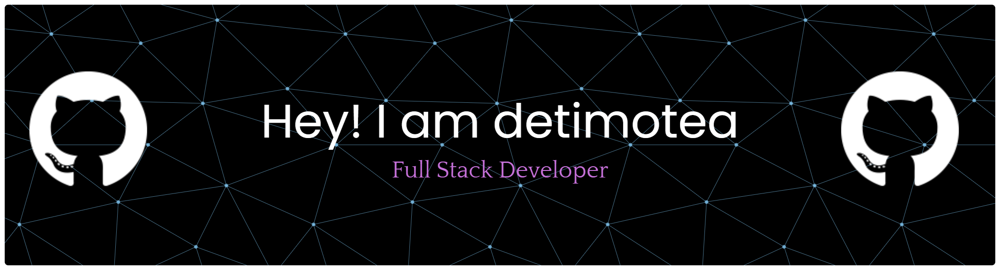

# Halo! Saya [David Timoteus] 👋

Saya seorang software developer yang senang membangun solusi digital yang bersih, efisien, dan berpusat pada pengguna. Saat ini saya sedang fokus mengeksplorasi teknologi baru dan membangun proyek-proyek *open-source*.

### 🛠️ Tech Stack
<!-- Silakan ganti atau tambahkan badge sesuai bahasa yang kamu kuasai -->

  
  
  
  

### 📊 Statistik Bahasa Pemrograman
<!-- GANTI "USERNAME_KAMU" DENGAN USERNAME GITHUB ASLI KAMU -->

  

