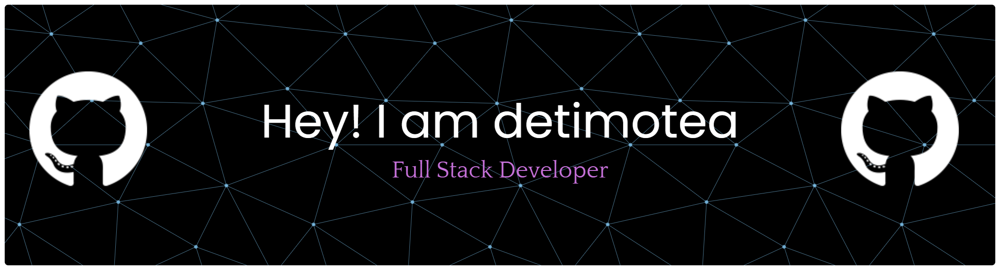

 

---

## 🧑‍💻 Tentang Saya

<table>
<tr>
<td width="62%" valign="top">

- 🔭 Sedang membangun **MyDuit** — pencatat keuangan pribadi berbasis **Google Apps Script + Tailwind CSS + Gemini AI**
- 🌱 Memperdalam ekosistem **Laravel** dan **Node.js**
- 👨‍💻 Pernah membangun **LMS**, **klickcare**, dan **route_wise** (Flutter × Odoo ERP)
- 💬 Tanya saya soal **Laravel, REST API, dan pengembangan web full-stack**
- ⚡ Senang mengubah ide menjadi aplikasi yang benar-benar dipakai orang

</td>
<td width="38%" valign="top">

</td>
</tr>
</table>

- 📫 Cara menghubungi saya: lewat badge di bagian [Terhubung Dengan Saya](#-terhubung-dengan-saya) di bawah

---

## 🛠️ Tech Stack

**Frontend**

 

**Backend & Database**

 

**Mobile & Tools**

---

## 📊 Statistik GitHub

 

---

## 🐍 Ular Pemakan Kontribusi

<picture>
  <source media="(prefers-color-scheme: dark)" srcset="https://raw.githubusercontent.com/DavidTimoteus/DavidTimoteus/output/github-contribution-grid-snake-dark.svg" />
  <source media="(prefers-color-scheme: light)" srcset="https://raw.githubusercontent.com/DavidTimoteus/DavidTimoteus/output/github-contribution-grid-snake.svg" />
  
</picture>

---

## 📈 Aktivitas Kontribusi

---

## 🏆 Trofi GitHub

---

## 💡 Progress Keahlian (Realtime, dihitung dari semua repo)

<!--LANG-STATS-START-->

| Skill | Level |
|---|---|
| **HTML** |  |
| **Blade** |  |
| **JavaScript** |  |
| **PHP** |  |
| **CSS** |  |
| **C++** |  |
| **CMake** |  |
| **SCSS** |  |

*Terakhir diperbarui otomatis: 2026-09-04 — dihitung dari seluruh repository publik.*

<!--LANG-STATS-END-->

---

## 🤝 Terhubung Dengan Saya

